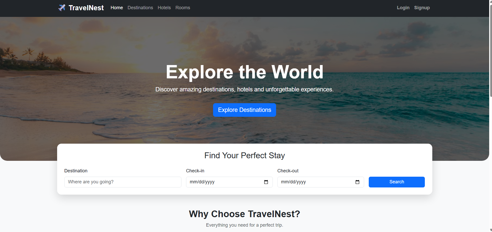
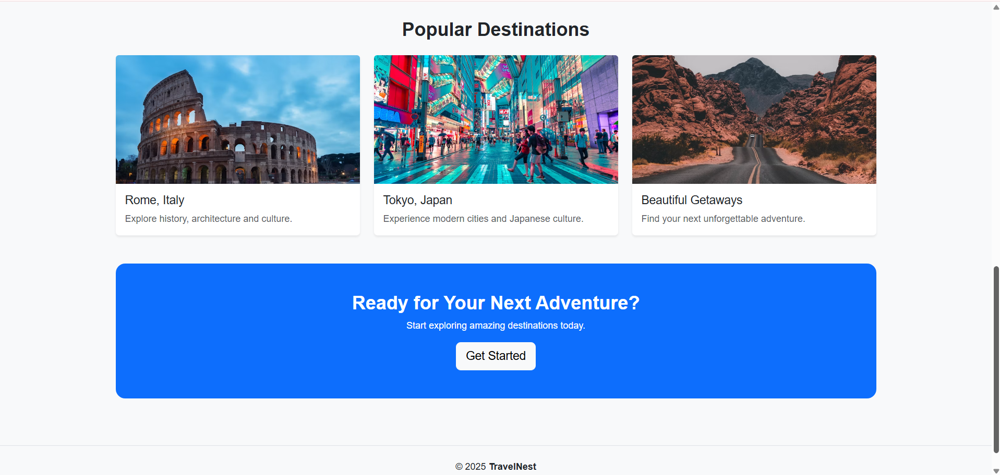

<div align="center">

# 🏨 TravelNest

### A Full-Stack Hotel Booking Platform Built with PHP & MySQL

*Database Lab Final Project*

[](https://www.php.net/)
[](https://www.mysql.com/)
[](https://getbootstrap.com/)
[]()

</div>

---

## 📖 Overview

**TravelNest** is a PHP and MySQL hotel booking application that lets users explore destinations, compare hotels and rooms, make bookings, submit reviews, and track their booking history — complete with an admin panel for management and reporting.

Beyond functioning as a booking platform, TravelNest was built to demonstrate real-world applications of core database concepts: CRUD operations, joins, aggregate functions, subqueries, set operations, views, filtering, grouping, and report generation.

<div align="center">
    
    
</div>

---

## 📑 Table of Contents

- [Features](#-features)
- [Database Concepts Demonstrated](#-database-concepts-demonstrated)
- [Database Structure](#-database-structure)
- [Application Pages](#-application-pages)
- [Technology Stack](#-technology-stack)
- [Requirements](#-requirements)
- [Setup and Installation](#-setup-and-installation)
- [Useful URLs](#-useful-urls)
- [Project Structure](#-project-structure)
- [Notes](#-notes)

---

## ✨ Features

### 👤 User Features

- 🔍 Browse destinations and filter by name, description, or country
- 🏨 Browse hotels by name, country, and price range
- 🛏️ View room availability, ratings, and applicable discounts
- 📅 Book available rooms with check-in, check-out, and guest details
- 📋 View booking history with status summaries
- ⭐ Submit hotel reviews and browse recent ones
- 🌟 Filter hotels with an average rating of 3.5 or higher
- 🔐 Register and log in with session-based authentication

### 🛠️ Admin Features

- 📊 View dashboard statistics for users, destinations, hotels, bookings, and reviews
- 💰 Track revenue, total payments, and average payment values
- 👥 Manage users and update roles
- 🏙️ Add, update, and delete destinations
- 🏨 Add, update, and delete hotels
- 🛏️ Add, update, and delete rooms
- 📦 View all bookings and update booking or payment status
- 🗑️ Delete bookings and related payment records
- 📈 Generate and download analytical reports

---

## 🗄️ Database Concepts Demonstrated

| Category | Concepts |
| --- | --- |
| **Core SQL** | `SELECT`, `INSERT`, `UPDATE`, `DELETE` |
| **Filtering & Sorting** | `WHERE`, `LIKE`, `IN`, `BETWEEN`, `ORDER BY`, `GROUP BY`, `HAVING` |
| **Aggregates** | `COUNT`, `SUM`, `AVG`, `MIN`, `MAX` |
| **Joins** | `INNER`, `LEFT`, `RIGHT`, self, equi, non-equi, natural, Cartesian |
| **Advanced Joins** | Simulated full outer joins via `UNION` |
| **Subqueries** | Finding hotels above the average rating |
| **Multi-table Queries** | Joins across users, bookings, rooms, hotels, destinations, and payments |
| **Views** | `v_hotel_details`, used by the admin dashboard |
| **Set Operations** | Membership and exclusion via `IN` / `NOT IN` |
| **Reporting** | Text-file report output, similar to SQL\*Plus `SPOOL` |

> 💡 Explore live SQL examples at `joins_demo.php`, and reporting tools at `index.php?page=admin_reports`.

---

## 🧩 Database Structure

| Table | Purpose |
| --- | --- |
| `users` | User details, login information, and roles |
| `destinations` | Destination names, countries, and descriptions |
| `hotels` | Hotels linked to destinations, including price and rating |
| `rooms` | Room types, prices, availability, and hotel relationships |
| `bookings` | Room reservations, dates, guests, and booking status |
| `payments` | Payment amount, method, and status for each booking |
| `reviews` | Hotel ratings and user comments |
| `discounts` | Price ranges and discount percentages for room pricing |

### Entity Relationships
```

destinations  1 ──── many  hotels

hotels        1 ──── many  rooms

users         1 ──── many  bookings

rooms         1 ──── many  bookings

bookings      1 ──── many  payments

users         1 ──── many  reviews

hotels        1 ──── many  reviews

```
---

## 🧭 Application Pages

| Page | Description |
| --- | --- |
| `index.php` | Main router and home page |
| `destinations.php` | Destination search and country filtering |
| `hotels.php` | Hotel listing, filtering, sorting, and country statistics |
| `rooms.php` | Room listing, availability, and discount calculation |
| `book.php` | Room booking form and availability update |
| `my_bookings.php` | Current user's bookings and status summary |
| `reviews.php` | Review submission, listing, and rating analysis |
| `search.php` | Natural-language travel search powered by Gemini-generated `SELECT` queries |
| `joins_demo.php` | Interactive examples of SQL join types |
| `admin_dashboard.php` | Admin statistics and summary dashboard |
| `admin_users.php` | User and role management |
| `admin_destinations.php` | Destination management |
| `admin_hotels.php` | Hotel management |
| `admin_rooms.php` | Room management |
| `admin_bookings.php` | Booking and payment-status management |
| `admin_reports.php` | SQL reports, analysis, and report generation |

---

## 🛠️ Technology Stack

| Layer | Technology |
| --- | --- |
| **Backend** | PHP 7.4+ / PHP 8.x |
| **Database** | MySQL / MariaDB |
| **Data Access** | PDO |
| **Frontend** | Bootstrap 5.3, Tailwind CSS (CDN), Bootstrap Icons |
| **AI Integration** | Gemini API (optional natural-language search) |
| **Server** | Apache, XAMPP, WAMP, or PHP's built-in dev server |

---

## ✅ Requirements

- PHP with the `PDO` and `pdo_mysql` extensions enabled
- MySQL or MariaDB server
- A modern web browser
- *(Optional)* Gemini API key and cURL support for `search.php`

---

## 🚀 Setup and Installation

### 1️⃣ Clone the repository

```bash
git clone <your-repository-url>
cd TravelNest---dabtabase-project
```

### 2️⃣ Create the database

Create a MySQL database named `travelnest` and load the SQL schema and sample data used for the lab.

> ⚠️ This repository currently includes only the PHP application files — no database dump. The schema must be created or imported separately.

### 3️⃣ Configure the connection

Edit `travelnest/config/db.php` with your local MySQL credentials:

```php
$host = '127.0.0.1';
$port = '3308';
$db   = 'travelnest';
$user = 'root';
$pass = '';
```

> ℹ️ The default configuration expects MySQL on port `3308`. Change it to `3306` if that's what your local setup uses.

### 4️⃣ Run the application

**Using PHP's built-in server:**

```bash
php -S localhost:8000 -t travelnest
```

Then open [http://localhost:8000](http://localhost:8000) in your browser.

**Using XAMPP / WAMP:**

Place the project inside your server's web directory and open:
```

[http://localhost/TravelNest---dabtabase-project/travelnest/](http://localhost/TravelNest---dabtabase-project/travelnest/)

```
---

## 🔗 Useful URLs

| URL | Purpose |
| --- | --- |
| `index.php` | Home page |
| `destinations.php` | Browse destinations |
| `hotels.php` | Browse and filter hotels |
| `reviews.php` | Submit and browse reviews |
| `joins_demo.php` | Explore SQL join examples |
| `login.php` | User login |
| `signup.php` | User registration |
| `index.php?page=admin_dashboard` | Admin dashboard |
| `index.php?page=admin_reports` | Admin reports |

---

## 📁 Project Structure
```

TravelNest---dabtabase-project/

├── README.md

└── travelnest/

├── config/

│   └── db.php

├── index.php

├── destinations.php

├── hotels.php

├── rooms.php

├── book.php

├── my_bookings.php

├── reviews.php

├── search.php

├── joins_demo.php

├── login.php

├── signup.php

├── logout.php

└── admin_*.php

```
---

## 📝 Notes

- Prepared statements are used for most user-input queries.
- Several pages use demo user ID `1` for the lab workflow — replace this with the authenticated session user's ID when extending the project.
- Keep API keys out of committed source code when enabling the Gemini search feature.
- Generated admin reports are written to `travelnest/report_output.txt` and can be downloaded via `download_report.php`.

---

<div align="center">

## 🎓 Academic Project

Developed as the **Database Lab Final Project** to apply relational database design and SQL concepts in a practical, real-world hotel-booking application.

</div>
